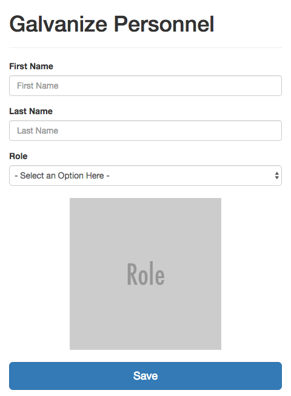
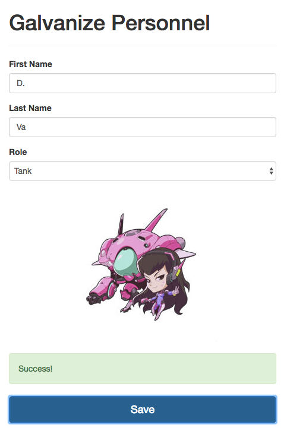

# Galvanize Personnel

You are making an app for your new company that assigns roles to employees. You'll need to:

* Build a form
* Read a list from an external URL
* Read values from a text input and a drop down
* Send form data to an external URL
* Respond to change events
* Manipulate the DOM
* Respond to callbacks
* Deploy to a public URL

## Steps

1. In an `index.html` file, import [Bootstrap](http://getbootstrap.com/) and create a form that includes:
    * A first name input (with a label)
    * A last name input (with a label)
    * A drop-down menu for roles (with a label and a disabled placeholder that says "Select an option here")
    * An image from [placehold.it](http://placehold.it) as a placeholder.
    * A save button
    * An empty paragraph with the class "save-status"
    * When finished, your form should look like this:

        

1. Using the included `./assets/scripts/app.js` file, add the following behavior:
    * Dynamically generate the list of roles by accessing the following API endpoint:

        ```
        http://galvanize-student-apis.herokuapp.com/gpersonnel/roles
        ```

    * Whenever the role is changed, the image should be updated with the `img` of that role.
    * Whenever the save button is clicked, *the default behavior should be prevented*, and the form values should be `POST`ed to:

        ```
        http://galvanize-student-apis.herokuapp.com/gpersonnel/users
        ```

    * The format for the POST should be: `{ firstName: 'First', lastName: 'Last', role: 'Role' }`.
    * No key in the POST body can be empty and the role must match one of the roles returned from the initial API call.
    * When the result of the `POST` from the save button returns, you should display the resulting `message` should be faded in over 500ms to the `.save-status` paragraph, displayed for 2000ms, and faded out over 500ms.
    * When finished, your form should be able to do this: 

1. Valid `POST` requests will return a message of `Success!`. Invalid messages will return `Not quite.`.

1. Remove the content in this readme file and replace it with a link to your deployed version.
